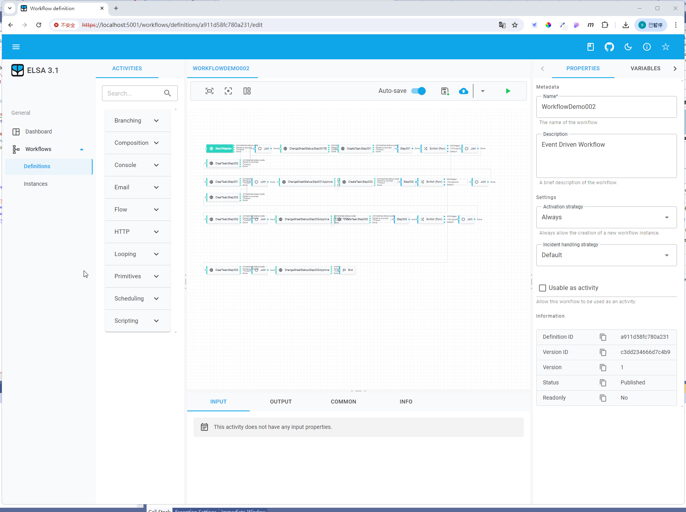
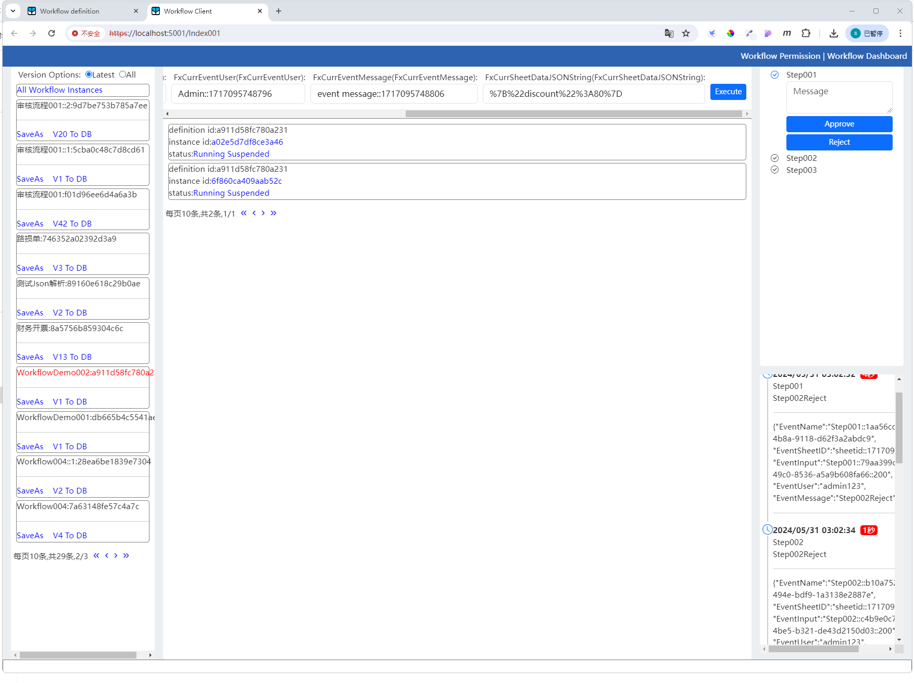
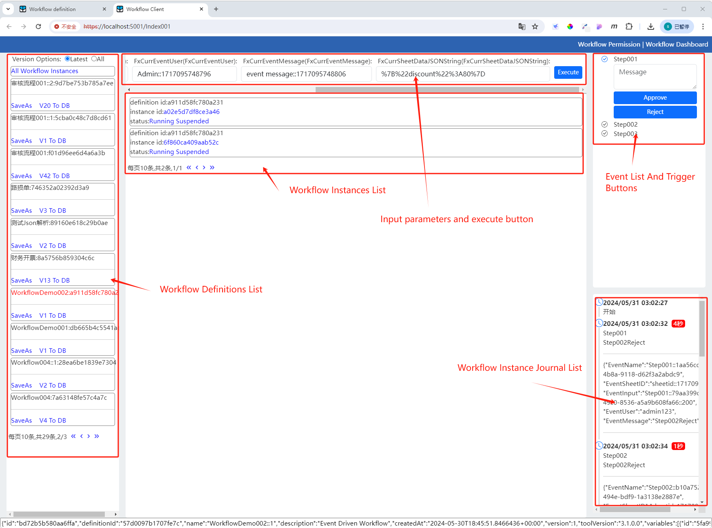
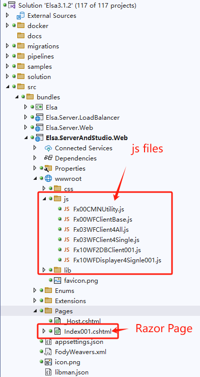

# FxElsaClient
This is a more feature-rich elsa client with the following features:

1. start workflow with input parameters.
2. trigger event with input parameters.
3. save an exist workflow definition as a new workflow definition
4. write workflow definition node to db
5. long running and event driven workflow supported

## Snapshot:

1:Start workflow with input parameters and trigger event with input parameters

2:Save current workflow as a new workflow:

3:Other functions:

4:project folders:

